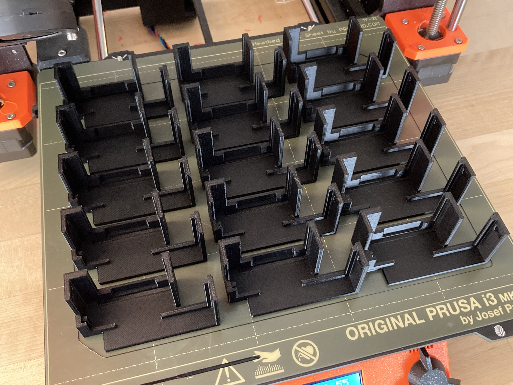

There are four main components of the Scopocket: the printed circuit board (PCB), display, battery, and case. This page lists instructions for obtaining each of these components..

## Printed Circuit Board
The manufacturing files needed to fabricate and assemble a Scopocket PCB can be found [here in the GitHub repository.](https://github.com/Cutout1/scope/tree/main/PCB%20Design%20Files/Scopocket%20v1.3) This includes the gerber file outlining the design of the board itself, the bill of materials which lists all components that need to be placed on the board, and the pick-and-place file describing where the components should be placed on the PCB.

I recommend using JLCPCB to manufacture the PCB. More extensive documentation for ordering the PCB will be included here in the near future, but essentially you just need to go to [JLCPCB's order page](https://cart.jlcpcb.com/quote), upload the gerber file, select the quantity of boards you want to order, click the slider for PCB assembly, go to the next page and upload the BOM and pick-and-place files, verify that all the parts appear on the board view correctly, and place the order.

## Display
The display is a generic 1.8 inch TFT LCD display module with an SPI interface available from a number of sellers.

I have verified the module available [at this page](https://www.aliexpress.us/item/2255801096152347.html) as being compatible with the Scopocket, and it is currently available at a cost of $1.65 per unit. Be sure to select the "1.8 TFT" option.

## Battery
The Scopocket should be usable with any single-cell lithium ion or lithium polymer battery, though not all form-factors will fit well inside the case. The battery connector on the PCB is a 2.0mm JST connector.

I recommend [this battery](https://www.aliexpress.us/item/2251832658151463.html) which is currently being sold in quantities of 10 for $16.50, coincidentally resulting in a unit cost exactly the same as the display: $1.65.

## Case
The case for the Scopocket is designed to be 3D printed in two separate pieces that clip together around the device. The STL 3D model files can be found [here in the GitHub repository.](https://github.com/Cutout1/scope/tree/main/Case%20Design%20Files)

The case should be printable with its largest face on the print bed without supports, as pictured below. Lower quality 3D printers may need some support for the clip.

