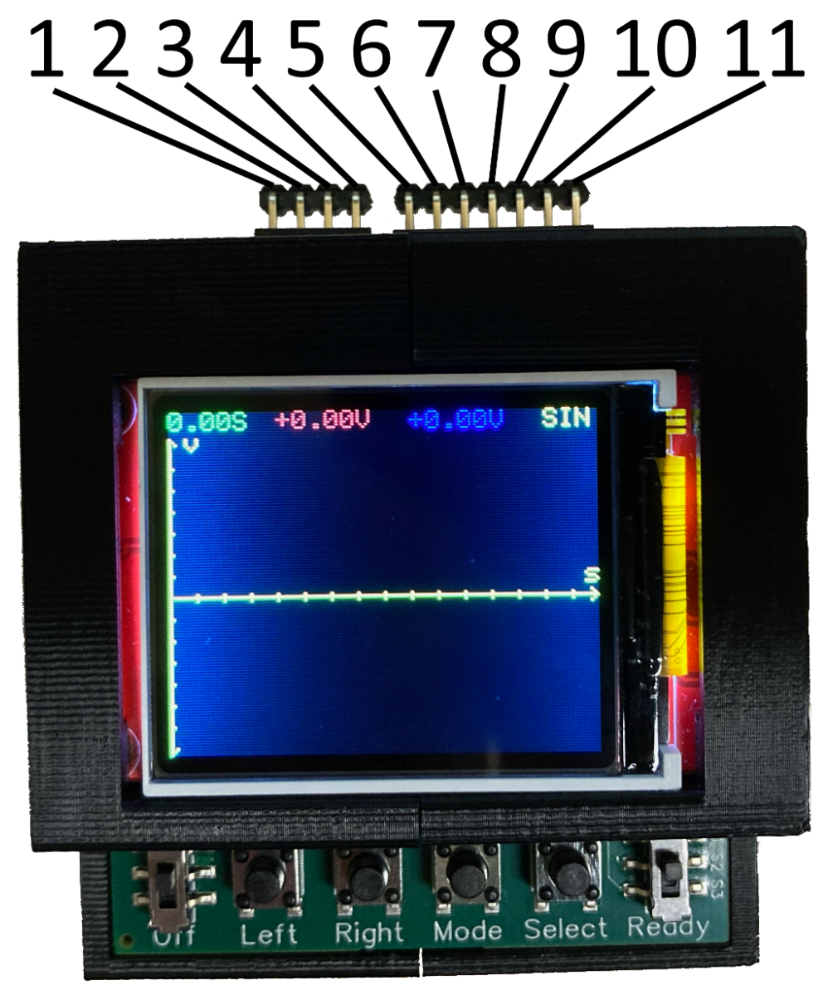

This page gives a detailed breakdown of what each pin on the Scopocket does. There are also pin labels on the underside of the Scopocket.

1. **Channel 1 Reference:** Reference voltage input for the oscilloscope’s first channel, which is plotted in red.
2. **Channel 1:** Voltage input for the oscilloscope’s first channel. The value that is plotted is equal to the voltage at this pin subtracted by the voltage at pin 1.
3. **Channel 2 Reference:** Reference voltage input for the oscilloscope’s first channel, which is plotted in blue.
4. **Channel 2:** Voltage input for the oscilloscope’s first channel. The value that is plotted is equal to the voltage at this pin subtracted by the voltage at pin 3.
5. **3.3V Output:** This pin outputs a steady 3.3V, limited to 75mA.
6. **0V Reference:** This pin outputs 0V.
7. **-3.3V Output:** This pin outputs a steady negative 3.3V, limited to 250mA.
8. **Switch 1:** This pin is connected to pin 9 when the switch is in the “Start” position.
9. **Switch 2:** This pin is connected to pin 8 when the switch is in the “Start” position, and it is connected to pin 10 when the switch is in the “Ready” position.
10. **Switch 3:** This pin is connected to pin 9 when the switch is in the “Ready” position.
11. **Waveform Output:** A configurable waveform is output with an amplitude up to 3.3V.

## Buttons and Switches
**Power Switch:** The switch on the left turns the Scopocket on and off. To preserve battery life, turn the Scopocket off when not in use.

**Left Button:** The left button is used to move the cursor left when reading a measured waveform. It may also be used to navigate the settings menu.

**Right Button:** The right button is used to move the cursor right when reading a measured waveform. It may also be used to navigate the settings menu.

**Mode Button:** The mode button is used to change the current settings of the Scopocket.

**Select Button:** The select button is used in the settings menu to select the currently underlined option. (Advanced software only)

**Trigger switch:** A recording can be triggered by moving the switch on the right from the “Ready” position to the “Start” position. It also changes the connection between pins 8, 9 and 10, as described in the previous section.

## Modes (Simple software only)
**SIN:** 2-channel oscilloscope sampling at 100 samples per second with a 1 Hz sine wave output from the waveform generator. Measurement begins immediately when the trigger switch is moved from “Ready” to “Start.”

**SQR:** 2-channel oscilloscope sampling at 100 samples per second with a 1 Hz square wave output from the waveform generator. Measurement begins immediately when the trigger switch is moved from “Ready” to “Start.”

**PHS:** 2-channel oscilloscope sampling at 100 samples per second with a 1 Hz sine wave output from the waveform generator. Measurement begins at the next peak of the output sine wave after the trigger switch is moved from “Ready” to “Start.”

**PWR:** This mode plots the power draw of a component in series with a 1kΩ resistor. To perform the measurement, place the channel 1 probes across a 1kΩ resistor in series with the load, and place the channel 2 probes across the load. Measurement begins when the load current reaches a peak. The power measurement is sampled at 100 samples per second, and a 1 Hz sine wave is output from the waveform generator.

**OHM:** Resistance measurement mode. To perform measurement, connect a resistor or resistor network between the channel 1 input and ground (pin 2 and pin 6). The screen will immediately display the resistance value in ohms.
